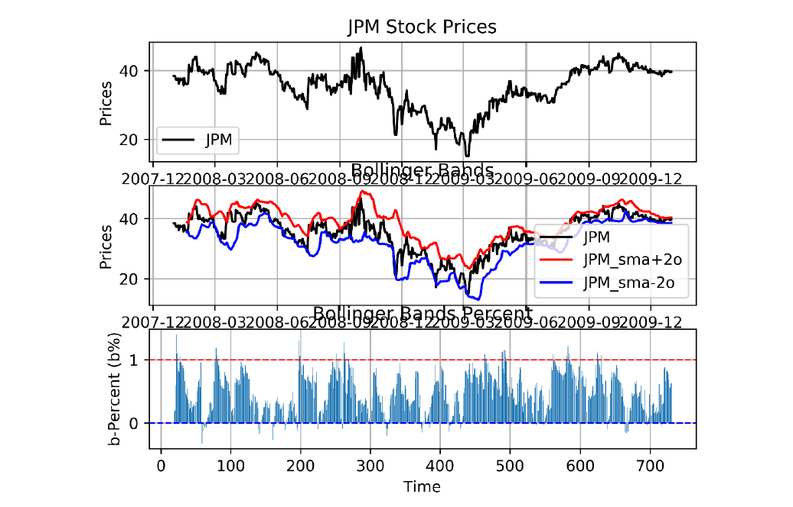
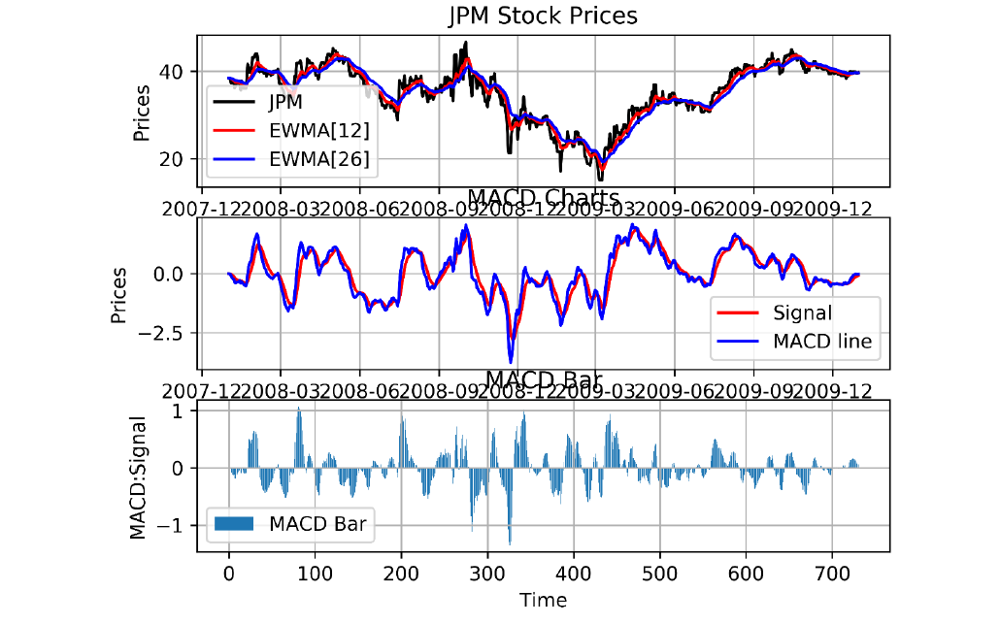
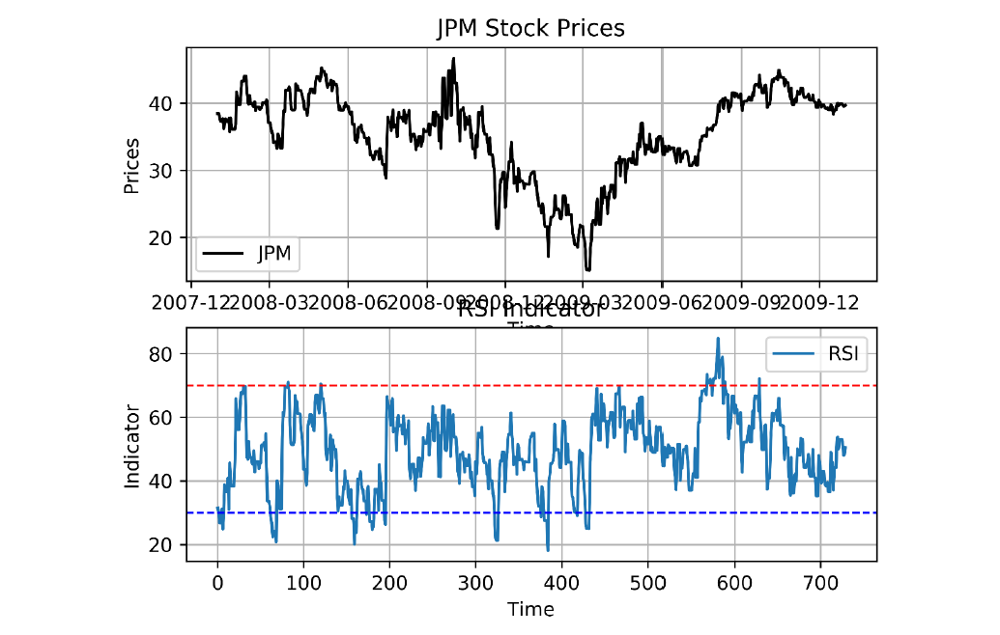
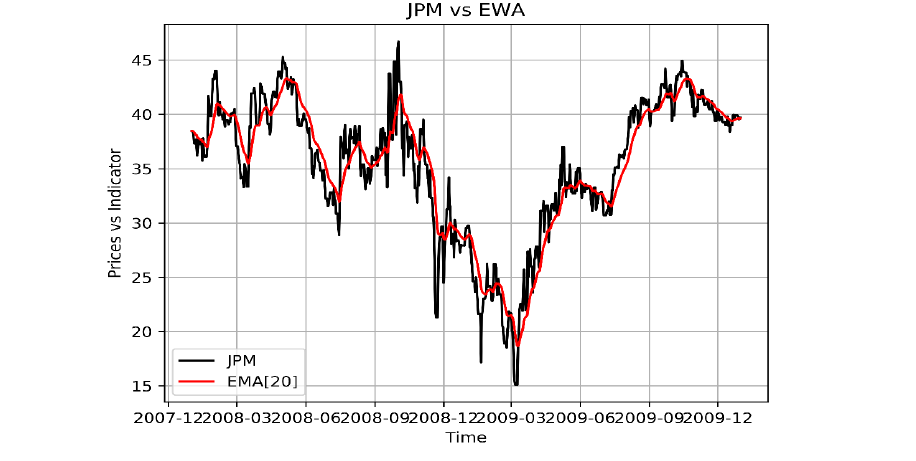

# Market Technical Indicators

## Introduction
The objective of this project is to showcase different indicators used in the stock market for trading decisions: 
Bollinger bands, %b, Relative Strength Index, and Moving Average Convergence Divergence. 
These help in identifying Bullish and Bearish market, and in deciding when to Short, Long, or Hold a position.
    
## Results
Bollinger Bands and b%:  
  
Moving Average Convergence Divergence:  
  
Relative Strength Index:  
  
Exponential Moving Average:  

